# SeedSigner Design System

### Contents:

* [Overview](#overview)
	- [Design Goals](#design-goals)
	- [Proposed Enhancements](#proposed-enhancements)
* [Key Performance Indicators](#key-performance-indicators)
* [Design System](#design-system)
	- [Measurements](#measurements)
	- [Typography](#typography)
	- [Color Palette](#color-palette)
	- [Layouts](#layouts)
	- [Components](#components)
	- [Icons](#iconography)
	- [Interactions](#interactions)
* [Content Strategy](#content-strategy)
	- [IA Best Practices](#ia-best-practices)

---

## Overview

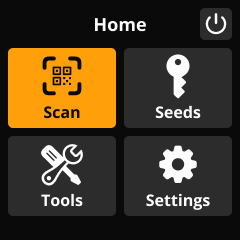

A modern, user-friendly GUI to make the SeedSigner software interface more accessible to non-technical users.

### Design Goals:

* **Visual Design:** Improve aesthetics and provide visual aids using UI treatments and iconography.
* **Interaction Design:** Increase overall efficiency of user inputs and feedback.
* **Information Architecture:** Improve findability by organizing and surfacing common tasks.
* **Content Design:** Simplify language to make abstract concepts more accessible to the average user.

### Proposed Enhancements:

* **Navigation:** Add Navigation Bar for context of location and easier access to global navigation functions
* **IA:** Accessible groupings of features, surface high-traffic actions
* **Content:** Simplify labels for viewport optimization and localization
* **Visual:** Add iconography to reduce cognitive load and aid localization
* **Visual:** Change font to a more legible but space-efficient typeface

---

## Key Performance Indicators

* **Efficiency** - Speed (less time/taps, more efficient paths)
	- Minimize button presses
	- More information with less scrolling
	- Predictable interactions and placement
* **Findability** 
	- Context of location (clear labeling, titles)
	- Menu IA (card sorting, tree testing)
* **Overall Satisfaction** (qualitative)
	- Ease-of-use
* **Project Success Measures**
	- Enclosure and pre-built device sales
	- Social media engagement
	- Increased awareness to targeted features
	- Reduction in support requests / complaints for targeted pain points

---

## Design System

**Prototype (WIP):** [Figma Prototype](https://www.figma.com/proto/SXln0v3bN0qE05kkP6wuED/seedsigner?page-id=0%3A1&node-id=2879%3A3954&viewport=241%2C48%2C0.31&scaling=min-zoom&starting-point-node-id=2879%3A3954&show-proto-sidebar=1)
- Arrow keys to navigate
- Space to select

**Design File:** [Figma](#)

## Measurements

**Standard Measurements (8px Grid System):**

- 4px
- 8px
- 12px
- 16px
- 24px
- 32px
- 64px

**Notes:**
- 8px margins maintained around layouts (224px usable space).
- 8px minumum padding between UI elements (when possible).
- Buttons/targets should be a minimum of 24px for legibility.

## Typography
 
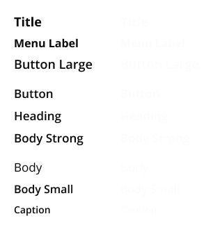
  
*All typography uses the Open Sans font family and follows a set of type styles, each with an associated font size (px), line height (px), and font weight.*
  
**Type Styles:**

- **Title:** 18px / 22 lh (Bold)
- **Menu Label:** 16px / 20 lh (Bold)
- **Button Large:** 18px / 22 lh (SemiBold)
- **Button:** 17px / 22 lh (SemiBold)
- **Heading** 17px / 22 lh (SemiBold)
- **Body Strong:** 17px / 22 lh (SemiBold)
- **Body:** 17px / 22 lh (Regular)
- **Body Small:** 16px / 20 lh (SemiBold)
- **Caption:** 14px / 18 lh (SemiBold)

## Color Palette
 

  
*The SeedSigner color palette is designed for a 'dark mode' interface.*
  
*Light text/images on a dark background provide adequate contrast, while color should be used sparingly in messaging or iconography when applicable.*
  
 **Background:** #0A0A0A

 **Container:** #2C2C2C

 **Container (Disabled):** #2C2C2C, 70%
  
 **Primary:** #FCFCFC
  
 **Secondary:** #FCFCFC, 70%
  
 **Active:** #FF9F0A
  
 **Informational:** #0084FF
  
 **Success:** #30D158
  
 **Warning:** #FFD60A
  
 **Error:** #FF453A

## Layouts
 
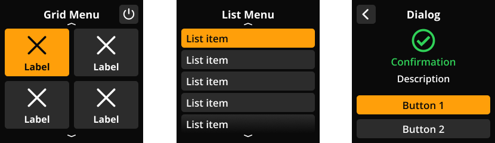

### Overview:

- Navbar present on all screens.
- Content area begins directly below Navbar.
 
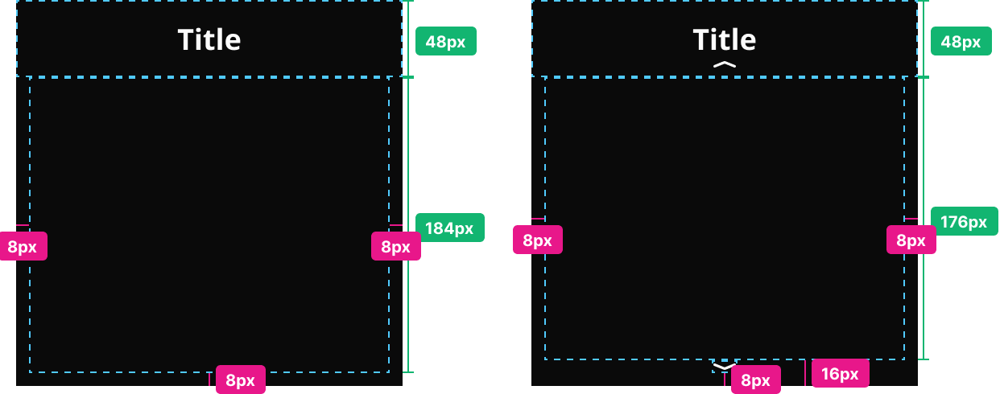
 
 
### Menus:

- Grid Menu
- List Menu
 
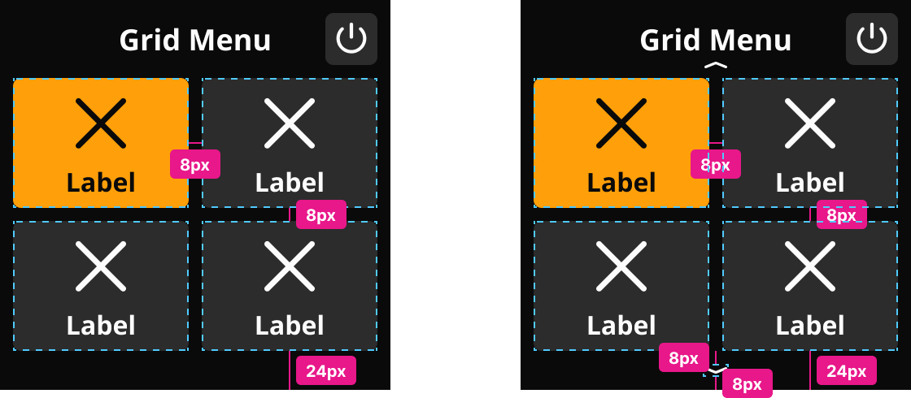
 
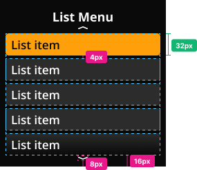
 
 
### Dialogs:

Variants:
- 1-button
- 2-button
- 3-button*

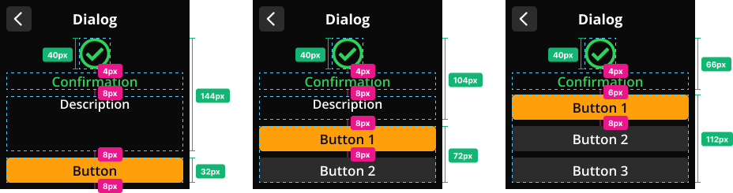
 
 
### Informational:

Variants:
- Transaction Details
- XPUB Details
 
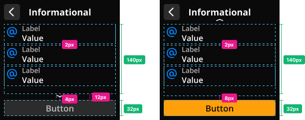
 
 
### Word List:

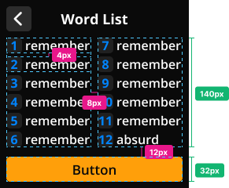
 
 
### Messaging:

Variants:
- Confirmation
- Warning
- Error
 
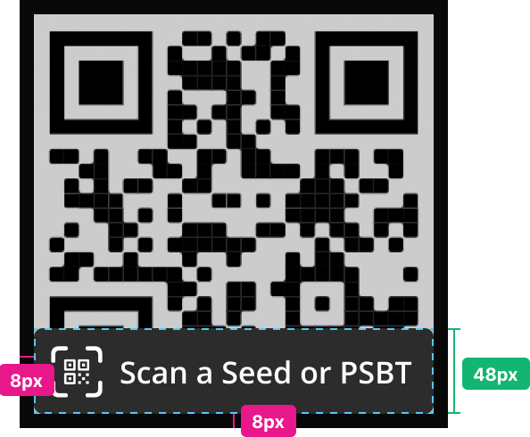
 
 
### Input:

- Word Input
- Keyboard Input (Passphrase, Derivation, etc.)
- Dice Input
 
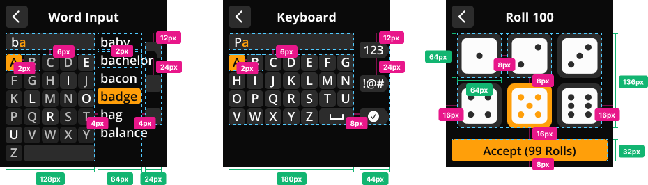
 

### Capture Photo:
 
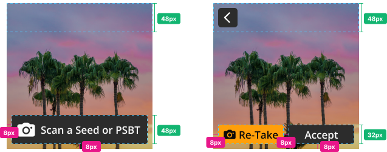
 
 
### Transcribe QR:

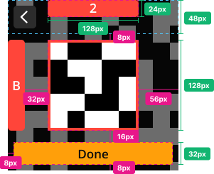
 
 
## Components

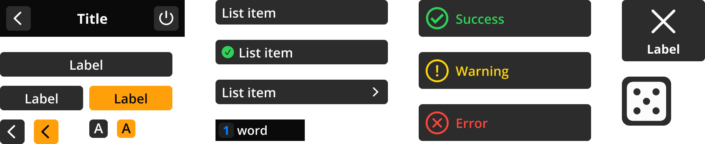
  
*Components are reusable building blocks that are aggregated to compose a screen layout, with each component serving a specific function.*

### Navigation Bar (240x48)

*Usage: Included on every screen, fixed to top of viewport.*

*All elements within the Navigation Bar are conditional. Titles should always be included when possible.*

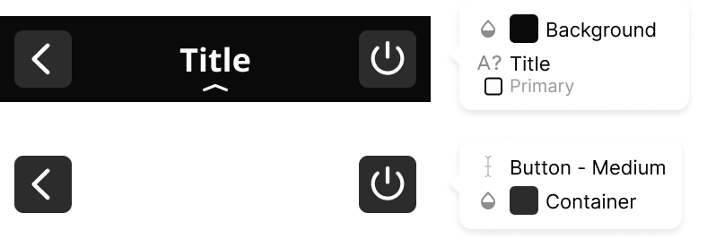
  
Anatomy:
- Back Arrow (Medium Button)
- Title (13 character max)
- Action Button (Medium Button)
- Down Arrow (For pagination, displayed when scroll-up is available)
  
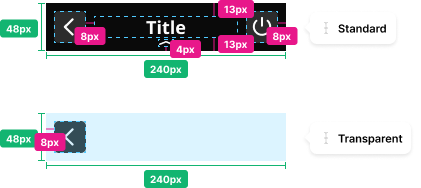
  
Variants:
- Standard
- Transparent (no title)

### Grid Item (108x80)

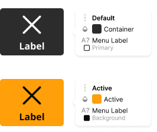
  
Anatomy:
- Contains: Icon (40x40)
- Label (10 character max)
  
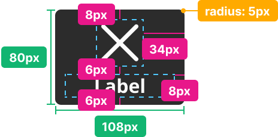
  
States:
- Default
- Active
- Disabled

### List Item (224x32)

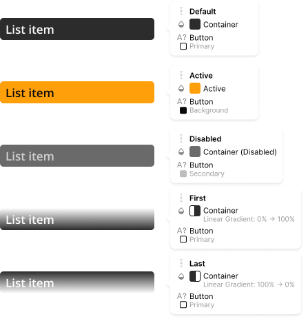
  
States:
- Default
- Active
- Disabled
- First
- Last
  
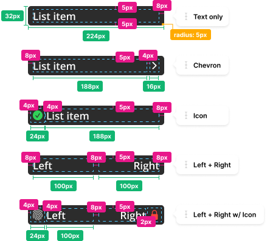
  
Variants:
- Left Text
- Left Text w/ Chevron
- Left Text w/ Icon
- Left + Right Text
- Left + Right Text w/ Icon

### CTAs

*Usage: Set of buttons allowing for selection from 1-3 options. Fixed to bottom of viewport.*
  
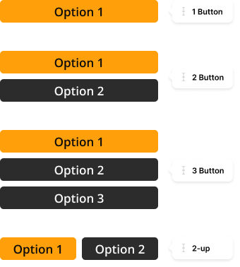
  
Variants:
- 1-Button (224x32)
- 2-Button (224x72)
- 3-Button (224x112)
- 2-up (224x32)
  
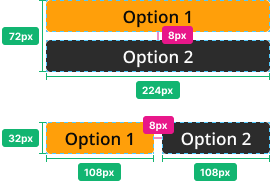

### Buttons

#### Large Button (224x32):

*Usage: Call-to-action*
  
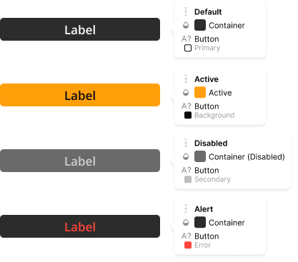
  
Sizes:
- Standard (100% width)
- 2-up (50% width)
  
States:
- Default
- Active
- Disabled
- Alert
  
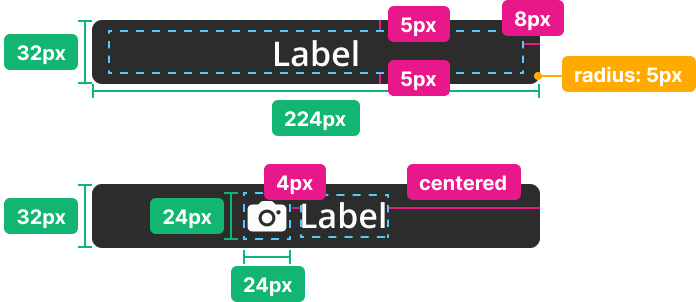
  
Variants:
- Text only
- Text w/ Icon

#### Medium Button (32x32)

*Usage: General, Navigation Bar*
  
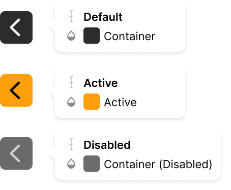
  
States:
- Default
- Active
- Disabled
  
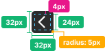

#### Small Button (24x24)

*Usage: Floating Action Buttons (icon), Keyboard Keys*
  
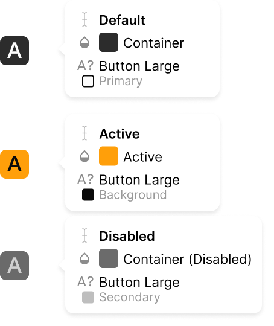
  
States:
- Default
- Active
- Disabled
  
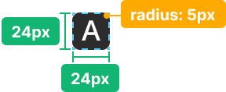

#### Flyout Button (48x24)

*Usage: Floating Action Buttons (text)*
  
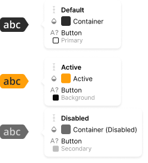
  
States:
- Default
- Active
- Disabled
  
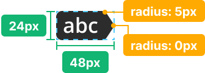

#### Word Input Button (64x24)

*Usage: Word Entry UI*
  
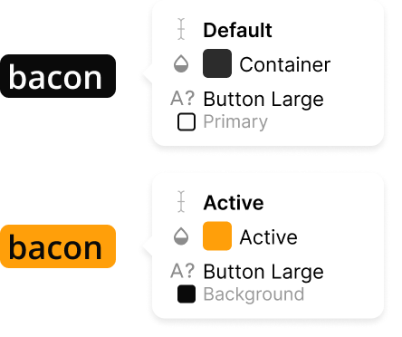
  
States:
- Default
- Active
  
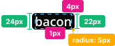

#### Dice Input Button (64x64)

*Usage: Dice Entry UI*
  

  
States:
- Default
- Active
  
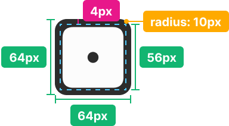

### Input Field (64x24)

*Usage: Passphrase Entry, Derivation Entry*
  
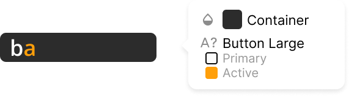
  
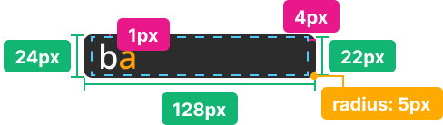

### Word List (108x20)

*Usage: View/Review Seed Words*
  
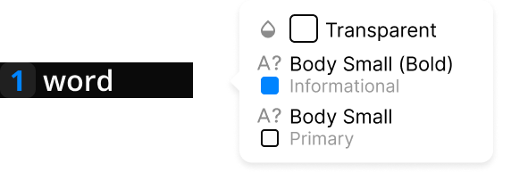
  
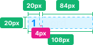

### Table

*Usage: Informational screens*
  
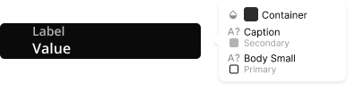
  
Variants:
- 1-row (224x40)
- 2-row (224x60)
- 3-row (224x80)
  
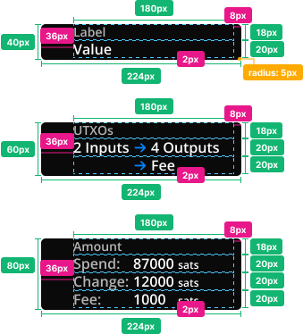

### Messaging

*Usage: Contextual overlays*
  

  
Messaging Types:
- Default
- Success
- Warning
- Error
  
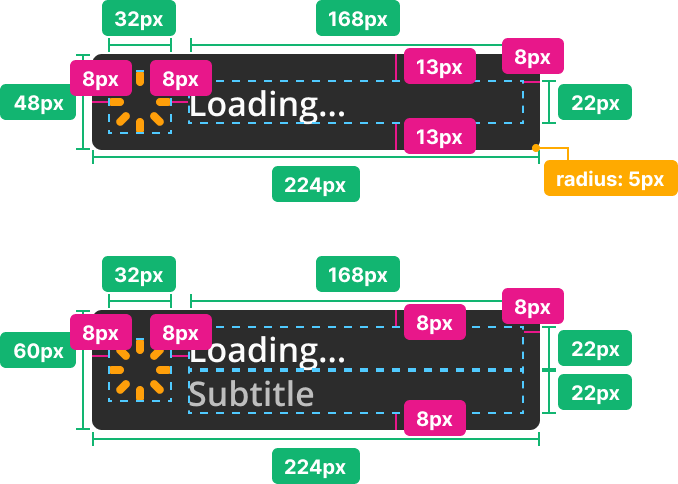
  
Variants:
- No Subtitle (224x48)
- Subtitle (224x60)

## Iconography

***Work-in-progress:** Some iconography uses the [FontAwesome](https://fontawesome.com/) icon library, denoted by an asterisk (*).*

### Menu:

- [Tools](https://fontawesome.com/icons/screwdriver-wrench?s=solid)* _(40x40)_

- [Sign*](https://fontawesome.com/icons/key?s=solid)* _(40x40)_

- [Settings](https://fontawesome.com/icons/gear?s=solid)* _(40x40)_

- [Power](https://fontawesome.com/icons/power-off?s=solid)* _(40x40)_

### Utility:

- [Back](images/icons/utility/back.svg) _(24x24)_

- [Page Up](images/icons/utility/page-up.svg) _(16x8)_
- [Page Down](images/icons/utility/page-down.svg) _(16x8)_
- [Chevron Right](images/icons/utility/chevron-right.svg) _(8x16)_
	
### Messaging:

- [Confirmation](images/icons/messaging/confirmation.svg) _(40x40)_

- [Warning](images/icons/messaging/warning.svg) _(40x40)_

- [Error](images/icons/messaging/error.svg) _(40x40)_

### Informational:

- Single-Sig
- Multi-Sig
- Private Key
- Passphrase
- Recipient
- Spend

- Change
- Fee
- [Derivation](images/icons/informational/derivation.svg)

- xpub

### Misc:

- Seed/Key
- Passphrase
- Generate XPUB
- Generate Last Word
- Wallet
- Network
- QR Code
- I/O Test
- Info
- Donate

- Save
- Available
- Unavailable
- Scan QR Code
- Scan Image
- Loading Spinner

## Interactions

#### Navigation:

- Next - Continue to next step
- Done - End of flow, return to entry point (non-destructive)
- OK/Close - Exit current screen (non-destructive)
- Cancel - End task and return to entry point (destructive)

---

## Content Strategy

### IA Best Practices:

### Clear and concise labeling

_Categories and labels should be clear and meaningful to users._
  
**Navigational labels should:**
- Make sense to all users, not just to advanced Bitcoin users
- Be concise -- maximum of 2 words if possible
- Only lead with an action verb when it's necessary for clarity
- Use "&"" instead of "and" for readability and space efficiency
- Meet users' expectations of what they'll find at a destination

### Intuitive groupings

_Like items should be clustered for enhanced discoverability._
  
**Navigational groupings should:**
- Meet user expectations (mental model)
- Consist of like items
- Adhere to cognitive load best practices
- Not have too many (or too few) items in a category

### Expected hierarchy

_The order of items should make sense and meet user expectations._
  
**Menu item hierarchy should:**
- Derive from user expectations
- Prioritize frequently-used and urgent tasks
- Leverage a common heirarchy of left-to-right or top-to-bottom based on frequency, urgency, and promoting awareness
- Utilize last position in a list (e.g. users expect Help/Contact near the bottom)

### Cognitive load control

_Decrease clutter that may confuse or distract users._
  
**To reduce cognitive load:**
- Limit the number of menus, categories, and items
- Avoid using a general category as a catch-all for orphan items
- Avoid visual clutter that may confuse or distract users

### Complementary contextual navigation

_When used, should align with the larger navigation ecosystem._
  
**Contextual navigation should:**
- Meet users' mental model for finding information and performing tasks
- Be easily visible and actionable
- Enhance but not duplicate the global navigation
- Create awareness of additional services/features

---

## Version History

**v0.1** __(2021-07-16)__
- Overview, design goals, proposed enhancements, preliminary design system
  
**v0.2** __(2021-09-14)__
- Table of contents, IA best practices, key performance indicators
  
**v0.3** __(2021-10-31)__
- Added layouts, added info tile and messaging components, updated color palette image, minor copy edits
  
**v0.4** __(2021-11-20)__
- Added typography, color palette, components